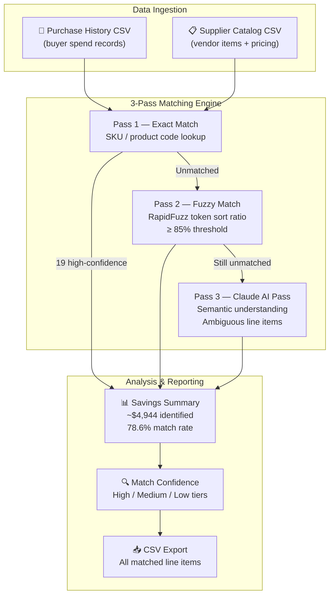
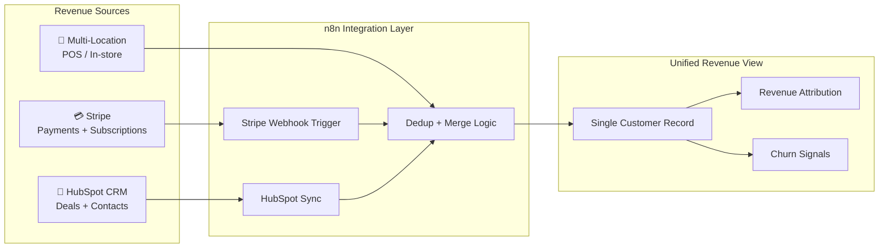

# Source Club — Case Study Submission

[](https://github.com/FlyguyTestRun/Source-Club/actions/workflows/ci.yml)
[](https://github.com/FlyguyTestRun/Source-Club/actions/workflows/deploy-azure.yml)

My response to the Source Club case study for the **Head of AI Powered Operations, Systems & RevOps**
role. One working app (Assignment 1) plus concise decision docs (2 & 3), a self-narrating video
walkthrough (4), and a bonus 90-day architecture scope.

> **Reviewers — start here:** [`INTERVIEWER_GUIDE.md`](./INTERVIEWER_GUIDE.md) is the 2-minute
> "how to run it and what to look at" guide. Everything below links straight to each deliverable.

---

## Deliverables — at a glance

| # | Assignment | What it is | Open it |
|---|-----------|-----------|----------|
| 1 | **Savings Analysis Automation** | **Working app** + 3-pass matching pipeline + sample data | [code & architecture](./assignment-1-savings-analysis/README.md) · run it ↓ |
| 2 | Stripe × HubSpot Integration | Decision doc: 3 options → recommendation (n8n), schema, multi-location model | [read](./assignment-2-stripe-hubspot/README.md) |
| 3 | Project Prioritization | The **real project queue**, ranked: top 5 for the first 90 days + what I'd defer | [read](./assignment-3-prioritization/README.md) |
| 4 | Video Walkthrough | **Self-narrating demo video** (built-in voiceover) + recording script | [folder](./assignment-4-video/README.md) · video ↓ |
| ⭐ | 90-Day Architecture Scope (bonus) | Platform decision + end-state system design + cost model | [read](./docs/90-day-architecture-scope.md) |

---

## Savings Analysis Pipeline — Architecture



**Result on sample data**: ~$4,944 in savings at 78.6% match rate (19 high-confidence matches).  
Works with no API key (fuzzy-only); add `ANTHROPIC_API_KEY` in `.env` to enable Claude pass.

---

## Run the app (Assignment 1)

```bash
pip install -r requirements.txt
streamlit run app.py            # opens http://localhost:8501
```

On the **Savings Analysis** page: click **Load sample** on both uploaders → **Run**.

Optional one-click hosting (Render / Hugging Face) in [`docs/DEPLOY.md`](./docs/DEPLOY.md).

---

## Watch the demo (Assignment 4) — with audio

A finished, **self-narrating** walkthrough covering all three assignments — the live savings
tool (1), the Stripe×HubSpot recommendation (2), and the prioritization (3) — with a natural neural
voiceover, ~3 min, no recording required. Three ways to play it, all with sound:

- **On GitHub (no install):** open
  [`demo/output/source-club-demo-narrated.mp4`](./demo/output/source-club-demo-narrated.mp4) →
  GitHub plays the MP4 inline. Press play, sound on.
- **Locally:** open `demo/output/source-club-demo-narrated.mp4` in any browser/player.
- **In the app:** `streamlit run app.py` → **Video Walkthrough** page → press play.

---

## Integration Architecture — Stripe × HubSpot (Assignment 2)



---

## How I approached it

- **Assignment 1** is running code you can try right now, structured as the team's own **two-part
  process** (collect & clean the purchase history → run the analysis).
- **Assignments 2 & 3** are concise, act-on-able decision docs — Assignment 3 prioritizes the
  **actual project queue**, not invented projects.
- The architecture reflects what I'd actually build, with explicit notes on what the POC skips.

**Confirmed vs. assumed:** the brief confirms only **Stripe** and **HubSpot**. Google Workspace,
GCP, **ZenOne**, **Base86**, and PandaDoc are working assumptions — flagged throughout.

---

## Repository layout

```
app.py                         Multipage Streamlit app — run this
INTERVIEWER_GUIDE.md           Reviewer quick-start (2 min read)
pages/                         5 pages: savings tool + 4 doc pages
assignment-1-savings-analysis/ matcher.py · report_generator.py · sample_data/
assignment-2-stripe-hubspot/   Decision doc
assignment-3-prioritization/   Real-queue prioritization
assignment-4-video/            Demo script — video in demo/output/
demo/                          record_narrated.py · voiceover-script.md
docs/                          Case study brief · 90-day architecture · DEPLOY.md
.github/workflows/             CI (test) + Deploy (Azure Container Apps)
```

---

**Supporting docs:**
[`docs/CASE-STUDY-BRIEF.md`](./docs/CASE-STUDY-BRIEF.md) ·
[`docs/questions-i-would-ask-first.md`](./docs/questions-i-would-ask-first.md) ·
[`docs/DEPLOY.md`](./docs/DEPLOY.md)
